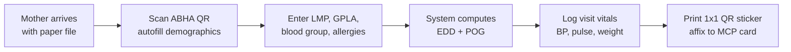
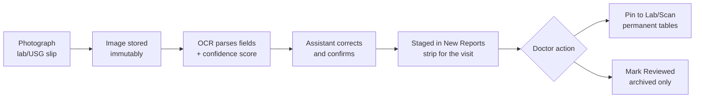
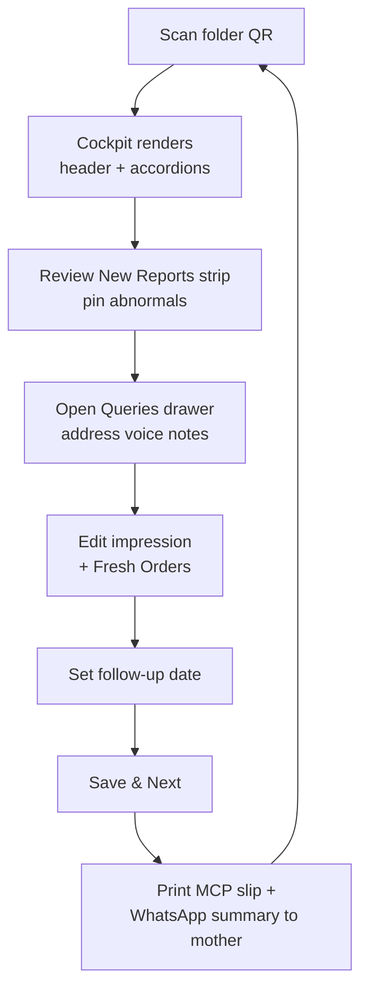
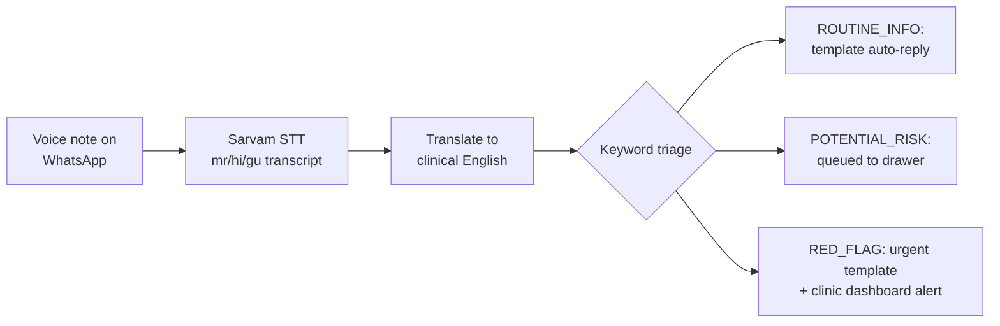
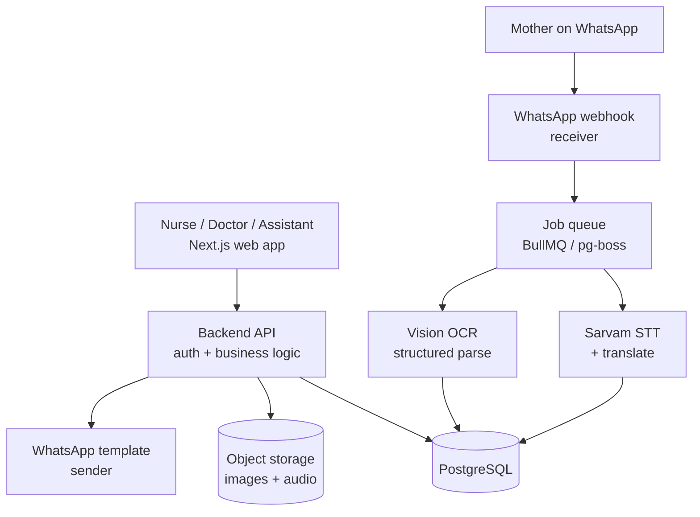
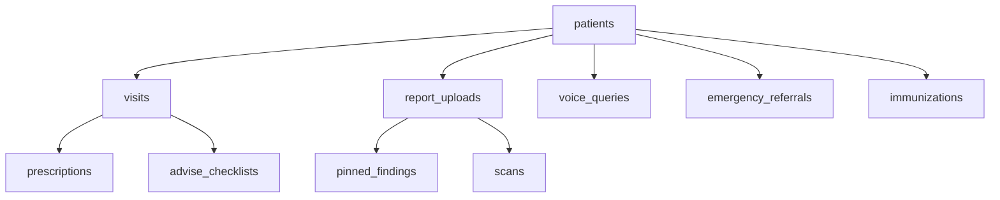

# MaatriSetu — PRD, Implementation Plan & Backend Schema

> Development update: see [the development foundation](development-foundation.md) for the current prototype scope, corrected data model, transaction rules, permissions and build checkpoints. It supersedes conflicting implementation details below; this PRD remains the original product vision.

2026-09-18 · @Someone

## 1. Executive summary

MaatriSetu is an assistive paper-to-digital consultation cockpit for high-volume Indian antenatal OPDs, built for Health-a-thon 2026 (IIT Bombay KCDH, Koita Foundation, FOGSI, Sarvam AI). A 1x1-inch QR sticker on the mother's existing paper file loads her entire verified obstetric history — labs, scans, prescriptions, past deliveries — onto one screen in under a second, so the OB-GYN spends the 2-minute consultation on the patient, not the paperwork.

The product has four pillars:

1. **1-second QR scan cockpit** — single-screen, accordion-based consultation view for the doctor.
2. **Multimodal OCR ingestion** — photographed lab slips and sonography sheets are parsed into structured milestone values with the original image retained.
3. **Vernacular voice triage** — mothers send WhatsApp voice notes in Marathi/Hindi/Gujarati; Sarvam AI transcribes, translates, and queues them as agendas or red flags.
4. **Emergency referral snapshot** — a standardized 1-page printable + QR-accessible handover slip for 2 AM labor-room transfers, including timestamped pre-referral doses (MgSO4, Labetalol, Betamethasone) to prevent redosing toxicity.

It is strictly **non-diagnostic**: it organizes and surfaces data that already exists in the patient's records. All clinical judgment stays with the doctor. A Stitch UI prototype of the cockpit already exists and serves as the visual reference for the frontend build.

## 2. Problem statement

Three failures dominate maternal care workflows in municipal tertiary hospitals (Sion, KEM, Nair) and busy private nursing homes:

| Problem | Evidence / impact |
| --- | --- |
| OPD paper bottleneck | 80–120 antenatal patients per 3-hour shift (\~2 min each); up to 40% of consult time lost flipping through crinkled files and MCP cards to find baseline Hb, OGTT/DIPSI, TIFFA clearance, or LSCS indication |
| Broken emergency continuity | 2 AM referrals arrive with illegible notes, missing serology/blood group, unknown placental localization; risk of repeating MgSO4 loading doses (toxicity) and redundant lab re-testing |
| Disorganized patient communication | Low-literacy mothers call repeatedly or spend consult time on routine doubts; danger signs (edema, bleeding, reduced fetal movements) reported late or missed entirely |

A secondary problem: rotating residents re-take histories every visit, increasing cognitive fatigue and error rates. Existing EMRs fail here because they demand full digitization and doctor-driven data entry — unworkable at 2 minutes per patient. MaatriSetu keeps the paper file as the source artifact and layers digital retrieval on top.

## 3. Goals, success metrics, and non-goals

### Goals

1. Cut per-patient record-retrieval time from \~45–60 seconds to under 5 seconds (QR scan to full cockpit render).
2. Zero double-entry: demographics via ABHA Scan & Share, labs via OCR, patient concerns via voice — the doctor only reviews, pins, and prescribes.
3. Every emergency transfer leaves with a complete, legible handover slip: blood group/Rh, scars, allergies, timestamped pre-referral doses, latest Hb/platelets, placental localization.
4. Triage patient voice notes so red flags surface immediately and routine questions never consume consult time.

### Success metrics (measure during pilot)

| Metric | Target |
| --- | --- |
| QR scan → cockpit fully rendered | < 1.5 s (cached), < 5 s (cold) |
| Time from lab slip photo → parsed values staged | < 30 s |
| OCR field accuracy on Indian lab formats (Hb, platelets, OGTT) | ≥ 95%, with 100% human review before pinning |
| Doctor consult time saved per patient | ≥ 40 s |
| Voice note transcription + triage turnaround | < 2 min |
| Emergency slips with all 6 required field groups complete | 100% |

### Non-goals (hard medico-legal boundaries, per FOGSI/Health-a-thon rules)

- **No diagnosis, no risk scoring, no CDSS behavior.** The system never interprets an ultrasound, predicts preeclampsia risk, or labels a patient high-risk on its own.
- **No autonomous prescribing or dosage recommendation.** Prescriptions are typed/edited by the doctor only.
- **No autonomous medical advice to patients.** The WhatsApp bot answers only pre-approved routine informational templates (e.g., iron–calcium spacing); anything clinical is queued for the doctor. Red-flag detection triggers a pre-written "come to hospital now" instruction, not advice.
- OCR output is always staged for human review — nothing enters the permanent record without a doctor's explicit pin/mark-reviewed action.
- Not a replacement for the paper file or MCP card; the physical folder remains the legal record.

## 4. Users & personas

| Persona | Device | Jobs to be done | Key constraint |
| --- | --- | --- | --- |
| Consulting OB-GYN (consultant / lecturer / MO) | Desktop or tablet, webcam or 2D barcode scanner | Absorb GPLA, POG, Rh status, vitals, and med flags in 5 s; pin abnormal reports; write orders; Save & Next | 2 minutes per patient; zero tolerance for scrolling or data entry |
| Triage nurse / registration staff | Desktop at OPD counter | ABHA Scan & Share registration; enter LMP, GPLA, blood group; log visit vitals; print QR sticker | High queue pressure; minimal training; form must be < 60 s |
| Diagnostic tech / intern / assistant | Smartphone or webcam | Photograph incoming lab slips and USG reports; confirm OCR-parsed fields | Photos taken in poor light on crumpled paper |
| Antenatal mother | Her own phone, WhatsApp only | Send voice questions in Marathi/Hindi/Gujarati; receive visit summaries and reminders | Often low literacy; no app install; voice-first |
| Labor-room / casualty doctor (receiving side) | Mobile phone | Open the emergency QR landing page mid-transfer; see doses already given | Reads it at 2 AM under stress; must be one page, high-contrast |

## 5. Feature requirements

Priorities: **P0** = must exist for a credible demo/pilot; **P1** = needed for real-clinic pilot; **P2** = post-pilot.

### P0 — Core cockpit & registration

| # | Feature | Acceptance criteria |
| --- | --- | --- |
| F1 | Patient registration | Nurse form captures name, age, phone, UHID, ABHA ID, LMP, GPLA, blood group/Rh, allergies, previous scars; EDD auto-computed via Naegele's rule; POG auto-computed daily; completes in < 60 s |
| F2 | QR sticker generation & scan | 1x1-inch printable QR encoding patient UUID; scan via webcam or HID barcode scanner loads cockpit in < 1.5 s; invalid/unknown QR shows clear error |
| F3 | Persistent header banner | Always-visible 3-row header: demographics + GPLA badge; LMP/EDD/POG + vitals with weight-gain delta; red pill for Rh-negative + Anti-D due, amber pill for allergies + previous LSCS. No fetal lie/presentation in header |
| F4 | New Reports strip | Horizontal card strip below header showing OCR-staged reports for this visit; actions: ★ Pin to Lab, ★ Pin to Scan, Mark Reviewed, View Slip (original image) |
| F5 | Accordion workspace | Six accordions per the UI spec (Ongoing Rx, Significant Labs, Significant Scans, Previous ANC History, Physician Impression, Fresh Orders & Advise) with specified default states and summary pills when collapsed; no vertical page scroll at 1920×1080 |
| F6 | Fresh Orders & Advise | Editable prescription lines (drug, dose, timing OD/BD/TDS/PRN, AC/PC); advise checklist (DFKC, MNT, left-lateral rest, lab orders, scan orders); follow-up date picker; Save & Next resets cockpit and persists the visit atomically |
| F7 | Serial lab sparklines | Pinned hematology values (esp. Hb) render a mini trend line (e.g., 11.2 → 9.8 → 8.6) |
| F8 | Print MCP visit slip | One-click A5/A4 printable visit summary matching MCP card fields |

### P0 — OCR ingestion

| # | Feature | Acceptance criteria |
| --- | --- | --- |
| F9 | Slip photo upload | Assistant photographs slip from phone/webcam; image stored immutably and linked to patient |
| F10 | Multimodal OCR parse | Extracts test name, date, and key values (Hb, WBC, platelets, OGTT fasting/2-hr, urine albumin, EFW, AFI, presentation, placenta) into a staged report; parse confidence shown; every field human-editable before staging completes |
| F11 | Review-before-commit | Nothing appears in permanent Significant tables without doctor pin; audit log records who pinned what and when |

### P1 — Voice layer & emergency referral

| # | Feature | Acceptance criteria |
| --- | --- | --- |
| F12 | WhatsApp voice intake | Mother sends voice note to a WhatsApp Business number; audio stored; Sarvam AI (Saaras) transcribes mr/hi/gu; translation to clinical English attached |
| F13 | Keyword triage | Rule-based (not ML-diagnostic) keyword matching buckets each note: ROUTINE\_INFO / POTENTIAL\_RISK / RED\_FLAG; red flags (bleeding, severe headache, no fetal movements, fits) send an immediate pre-approved "go to hospital" template and alert the clinic dashboard |
| F14 | Patient Queries drawer | Off-canvas right drawer from header button; shows original transcript, English translation, triage tag, auto-answered routine templates; Mark Addressed commits to consultation record |
| F15 | Emergency Referral Mode | One click generates the 1-page slip + mobile QR landing page with all 6 field groups (metadata, safety parameters, transfer vitals, timestamped pre-referral doses, PV findings, diagnostic summary); print + share via WhatsApp |
| F16 | ABHA Scan & Share | Registration autofills from ABDM QR token (name, age, ABHA, phone) |

### P2 — Post-pilot

- ABDM FHIR R4 export (care-context linking, health-record push to PHR apps)
- Full investigation archive viewer (LFT, RFT, HPLC HbA2, ferritin, Anti-D titers) with filters
- Offline-first OPD caching and sync (network drops mid-shift)
- Multi-clinic tenancy, role-based dashboards, analytics (anemia prevalence, follow-up compliance)
- Immunization reminder pushes (Td 2 due) via WhatsApp

## 6. App flows

### 6.1 Registration & QR issuance (nurse)

No ABHA QR available → manual demographic entry with phone-number dedup check. Repeat visits skip to vitals entry only.

### 6.2 Report ingestion (assistant → doctor)

### 6.3 Consultation (doctor, target < 2 min)

Save & Next is atomic: visit record, orders, pinned reports, and addressed queries commit together; failure rolls back with the cockpit state preserved.

### 6.4 Voice triage (mother → clinic)

### 6.5 Emergency referral (any staff, one click)

Doctor opens Emergency Referral Mode → form pre-fills identifiers, blood group/Rh, scars, allergies, latest Hb/platelets/serology, last placental localization → doctor enters transfer vitals, PV findings, and timestamped pre-referral doses → system generates the printable slip and a tokenized mobile landing page bound to the same QR → receiving doctor scans and sees everything before the ambulance arrives.

## 7. System architecture

Recommended stack — optimized for a 4-person team shipping a pilot fast, using your Stitch prototype as the frontend reference:

| Layer | Choice | Why |
| --- | --- | --- |
| Frontend | Next.js 14 (App Router) + React + Tailwind CSS + Lucide + Framer Motion | Matches PRD spec; convert Stitch export into componentized cockpit |
| State | Zustand (cockpit session) + TanStack Query (server cache) | Lightweight; instant cockpit reset on Save & Next |
| Backend API | Node.js (NestJS or Express + tRPC) or Next.js API routes for the pilot | One language across stack; fastest for the team |
| Database | PostgreSQL (Supabase for pilot: auth, storage, RLS in one) | Relational fits the schema; Supabase removes infra work |
| File storage | Supabase Storage / S3 | Immutable slip images, USG images, voice audio |
| OCR | Vision LLM (Claude / Gemini multimodal) with structured JSON output; fallback Google Document AI | Handles messy Indian lab formats better than raw Tesseract; confidence per field |
| Speech | Sarvam AI Saaras (STT + translate) | Hackathon partner; native mr/hi/gu support |
| Messaging | WhatsApp Business Cloud API (Meta) with webhook receiver | Voice-note intake + template pushes |
| QR | Server-generated (patient UUID token), printed thermal; scanned via webcam (zxing-js) or HID scanner (keyboard wedge) | HID scanners need no code — they type the token |
| Interop (P2) | ABDM sandbox: ABHA verification, Scan & Share, FHIR R4 bundles | Required for real deployment; sandbox first |

### Services & data flow

OCR and STT run asynchronously through the job queue so slip upload and voice intake never block the UI; the New Reports strip and Queries drawer poll or subscribe (Supabase Realtime) for staged results.

### Key architectural decisions

1. **QR encodes an opaque UUID token, never patient data.** Losing a sticker leaks nothing; the token resolves only for authenticated clinic users. Emergency landing pages use a separate short-lived signed token.
2. **Two-tier report model.** `report_uploads` (immutable image + raw OCR JSON) is separate from `pinned_findings` (doctor-curated permanent record). This enforces review-before-commit at the schema level.
3. **Append-only audit log** on every clinical write (pin, order, referral) for medico-legal defensibility.
4. **POG computed at read time** from LMP (never stored stale) so the header badge is always current.

## 8. Backend schema (PostgreSQL)

All tables carry `id UUID PK default gen_random_uuid()`, `created_at`, `updated_at`. Enums shown inline.

### patients

| Column | Type | Notes |
| --- | --- | --- |
| uhid | text unique | e.g., MH-2026-89412 |
| abha\_id | text unique nullable | 14-digit ABHA |
| name | text |  |
| age | int |  |
| phone | text indexed | WhatsApp identity key |
| lmp | date |  |
| edd | date | computed on write (Naegele) |
| gravida / para / living / abortions | int each | GPLA badge |
| blood\_group | enum A+..O- |  |
| is\_rh\_negative | boolean | drives red header pill |
| anti\_d\_status | enum: not\_applicable / due / given |  |
| allergies | text\[\] | amber pill |
| previous\_scars | jsonb\[\] | {type: 'LSCS', year, indication, interval\_ok} |
| pre\_pregnancy\_weight\_kg | numeric |  |
| qr\_token | text unique indexed | opaque; printed in sticker |
| clinic\_id | UUID FK → clinics | multi-tenancy from day 1 |

### visits

| Column | Type | Notes |
| --- | --- | --- |
| patient\_id | UUID FK |  |
| visit\_date | date |  |
| bp\_systolic / bp\_diastolic | int |  |
| pulse\_bpm | int |  |
| weight\_kg | numeric | weight-gain delta computed vs pre-pregnancy |
| pog\_weeks / pog\_days | int | snapshot at visit for the record |
| physician\_impression | text | Accordion 5 narrative |
| status | enum: open / saved | Save & Next flips to saved |
| seen\_by | UUID FK → users |  |

### report\_uploads (immutable ingestion tier)

| Column | Type | Notes |
| --- | --- | --- |
| patient\_id / visit\_id | UUID FK | visit nullable (between-visit uploads) |
| image\_url | text | original slip, never deleted |
| ocr\_raw | jsonb | full model output + per-field confidence |
| parsed\_type | enum: CBC / OGTT / SEROLOGY / URINE / USG / LFT / RFT / HPLC / OTHER |  |
| parsed\_fields | jsonb | {hb: 8.6, wbc: 4200, ...} after human correction |
| review\_status | enum: staged / pinned / reviewed\_archived | F11 gate |
| uploaded\_by / reviewed\_by | UUID FK | audit |

### pinned\_findings (doctor-curated permanent tier)

| Column | Type | Notes |
| --- | --- | --- |
| patient\_id | UUID FK |  |
| source\_upload\_id | UUID FK → report\_uploads | provenance link |
| category | enum: HEMATOLOGY / BIOCHEMISTRY / SEROLOGY / URINE / SCAN | routes to Accordion 2 vs 3 |
| test\_name / test\_date / summary | text, date, text |  |
| is\_abnormal | boolean | red styling |
| numeric\_series\_key | text nullable | e.g., 'hb' — joins serial values into the sparkline |
| numeric\_value | numeric nullable |  |
| pinned\_by | UUID FK | audit |

### scans (milestone ultrasounds)

| Column | Type | Notes |
| --- | --- | --- |
| patient\_id / source\_upload\_id | UUID FK |  |
| gestational\_week | int | 12 / 20 / 32 / 36 |
| scan\_type | enum: NT\_NB / TIFFA / GROWTH\_DOPPLER / OTHER |  |
| findings | text |  |
| efw\_grams / afi\_cm | numeric nullable |  |
| fetal\_presentation | enum: CEPHALIC / BREECH / TRANSVERSE nullable | shown here, never in header |
| placenta\_position | text nullable | previa rule-out on referral slip |
| image\_url | text nullable |  |

### prescriptions & orders

| Table | Columns | Notes |
| --- | --- | --- |
| prescriptions | visit\_id FK, medicine\_name, dosage, timing enum (OD/BD/TDS/PRN), relation\_to\_food enum (AC/PC), is\_ongoing bool | is\_ongoing=true rows populate Accordion 1 |
| advise\_checklists | visit\_id FK, dfkc bool, mnt bool, left\_lateral\_rest bool, lab\_orders text\[\], scan\_orders text\[\], next\_followup\_date date | Accordion 6 sub-pane B |
| immunizations | patient\_id FK, vaccine enum (Td1/Td2/TdBooster), status enum (completed/pending), date\_given |  |

### voice\_queries

| Column | Type | Notes |
| --- | --- | --- |
| patient\_id | UUID FK | matched by WhatsApp phone |
| audio\_url | text |  |
| language | enum: mr / hi / gu / en |  |
| transcript\_original / translation\_en | text |  |
| triage\_category | enum: ROUTINE\_INFO / POTENTIAL\_RISK / RED\_FLAG | rule-based |
| suggested\_flag | text | e.g., 'Dependent edema vs r/o early preeclampsia' |
| auto\_reply\_template\_id | text nullable | routine only |
| is\_resolved | boolean | Mark Addressed |
| resolved\_in\_visit\_id | UUID FK nullable | commits to record |

### emergency\_referrals

| Column | Type | Notes |
| --- | --- | --- |
| patient\_id / created\_by | UUID FK |  |
| referring\_facility / contact\_doctor / receiving\_facility | text |  |
| departure\_at | timestamptz |  |
| transfer\_vitals | jsonb | bp, pulse, spo2, rr, urine\_albumin, fhr |
| pre\_referral\_meds | jsonb\[\] | {drug, dose, route, given\_at} — MgSO4, Labetalol, Betamethasone; timestamps mandatory |
| pv\_exam | jsonb | dilatation, effacement, station, membranes, liquor |
| lines\_catheters | text |  |
| indication | text |  |
| diagnostic\_summary | jsonb | latest hb, platelets, serology, placenta localization (auto-filled) |
| share\_token | text unique | short-lived signed token for the mobile landing page |
| token\_expires\_at | timestamptz |  |

### users, clinics, audit\_log

| Table | Columns | Notes |
| --- | --- | --- |
| users | name, role enum (doctor/nurse/assistant/admin), phone, clinic\_id FK, auth\_id | RBAC per role |
| clinics | name, type enum (municipal/private), address |  |
| audit\_log | actor\_id FK, action, entity\_table, entity\_id, payload jsonb, at timestamptz | append-only; triggers on clinical writes |

### Entity relationships

## 9. API surface

REST-style; all routes behind clinic-scoped auth except the tokenized referral page and the WhatsApp webhook.

| Module | Endpoint | Purpose |
| --- | --- | --- |
| Patients | POST /patients | Register (manual or ABHA-prefilled); returns qr\_token |
|  | GET /patients/by-qr/:token | The 1-second scan — returns full cockpit payload in one response (header, accordions, staged reports, unresolved queries) |
|  | PATCH /patients/:id | Update baselines, allergies, scars |
| Visits | POST /patients/:id/visits | Nurse opens visit with vitals |
|  | POST /visits/:id/save-next | Atomic commit: impression, prescriptions, checklist, follow-up, pins, resolved queries |
|  | GET /visits/:id/mcp-slip | Printable visit slip (PDF/HTML) |
| Reports | POST /patients/:id/uploads | Multipart image → enqueue OCR job |
|  | GET /uploads/:id | Staged parse + confidence for correction UI |
|  | PATCH /uploads/:id | Human-corrected parsed\_fields |
|  | POST /uploads/:id/pin | Creates pinned\_finding or scan; sets review\_status |
|  | POST /uploads/:id/mark-reviewed | Archive without pinning |
|  | GET /patients/:id/archive | Full investigation archive modal |
| Voice | POST /webhooks/whatsapp | Meta webhook: audio in → enqueue STT + triage |
|  | GET /patients/:id/queries?unresolved=true | Drawer contents |
|  | POST /queries/:id/resolve | Mark Addressed |
| Referrals | POST /patients/:id/referrals | Create; auto-fills diagnostic\_summary; returns share\_token |
|  | GET /referral/:share\_token | Public mobile landing page (signed, expiring) |
|  | GET /referrals/:id/print | 1-page printable slip |
| Admin | POST /auth/login, GET /me | Role-based session |

Cockpit payload contract note: `GET /patients/by-qr/:token` must return everything the cockpit renders in a single round trip (< 1.5 s target) — compute POG server-side, join sparkline series, and include counts for collapsed accordion summary pills.

## 10. Implementation plan (6 phases, \~10–12 weeks to pilot)

Sequence assumes 2 engineers + 2 doctors (doctors own test data, clinical review of OCR prompts, and field validation). Each phase ends in a demoable checkpoint.

### Phase 0 — Foundations (Week 1)

- Repo, CI, environments; Supabase project (Postgres + Auth + Storage + RLS); Next.js scaffold.
- Run the full schema migration from Section 8; seed with 10 realistic dummy patients (Sunita Devi dataset included).
- Convert the Stitch prototype into the component tree: `<HeaderBanner>`, `<NewReportsStrip>`, `<Accordion*>` × 6, `<QueriesDrawer>` — static props first.
- **Checkpoint:** cockpit renders pixel-close to the Stitch prototype on seeded data at 1080p, no scroll.

### Phase 1 — Registration + QR + live cockpit (Weeks 2–3)

- Nurse registration form with EDD/POG computation; vitals entry; QR token generation + thermal-sticker print CSS.
- Webcam scan (zxing-js) + HID scanner input capture; `GET /patients/by-qr/:token` single-payload endpoint.
- Save & Next atomic transaction; MCP slip print view; audit-log triggers.
- **Checkpoint (core demo):** register → print sticker → scan → cockpit → orders → Save & Next → slip, end to end under 2 minutes.

### Phase 2 — OCR ingestion (Weeks 4–5)

- Upload endpoint + job queue; Vision-LLM prompt returning strict JSON per report type with per-field confidence; doctors iterate the prompt against 30+ real anonymized slips (CBC, OGTT, USG, serology).
- Correction/confirmation UI for the assistant; New Reports strip wired to staged uploads; Pin / Mark Reviewed flows; Hb sparkline from pinned serial values.
- **Checkpoint:** photograph a crumpled CBC slip → corrected values staged in < 30 s → doctor pins → appears in Significant Labs with trend.

### Phase 3 — Emergency referral (Week 6)

- Referral form with auto-filled diagnostic summary; timestamped pre-referral meds entry; 1-page print layout; signed-token mobile landing page.
- **Checkpoint:** the 2 AM story — create referral on desktop, open landing page on a phone via QR, all six field groups visible.

### Phase 4 — Voice layer (Weeks 7–8)

- WhatsApp Business Cloud API setup (number, webhook, templates through Meta review — start template approval early, it takes days); audio download + storage; Sarvam Saaras STT + translation jobs.
- Rule-based keyword triage (doctor-authored red-flag lexicon in mr/hi/gu); routine auto-reply templates; Queries drawer wired end to end; visit-summary push after Save & Next.
- **Checkpoint:** Marathi voice note → transcript + translation + triage tag in drawer in < 2 min; red-flag note triggers urgent template + dashboard alert.

### Phase 5 — Hardening + pilot (Weeks 9–12)

- RBAC enforcement per persona; offline caching of the day's queue; error/empty states; load test scan endpoint; ABHA Scan & Share against ABDM sandbox.
- Field pilot at 1–2 sites (per outreach plan: Sion OPD contacts, Parakh/Bhaktivedanta nursing homes); measure the Section 3 metrics; iterate weekly.
- **Checkpoint:** one full OPD shift run live with a consultant; metrics report against targets.

### Suggested split

| Workstream | Owner |
| --- | --- |
| Frontend cockpit + print layouts | Engineer 1 |
| Backend, OCR/STT pipelines, WhatsApp | Engineer 2 |
| OCR prompt validation, triage lexicon, clinical QA, seed data | Dr. Panchal + Dr. Raut |
| Site outreach & pilot logistics (parallel from Week 4) | Doctors, per outreach strategy |

## 11. Security, privacy, compliance & risks

- **Data protection:** health data of Indian citizens → DPDP Act 2023 obligations: consent capture at registration (record consent artifact in DB), purpose limitation, data-principal access. Store data in-region.
- **Access control:** clinic-scoped RLS; role-based permissions (nurse cannot pin findings, assistant cannot see prescriptions); referral landing pages via short-lived signed tokens only.
- **Immutability & audit:** slip images and audio are write-once; append-only audit\_log on every clinical action — this is the medico-legal backbone.
- **ABDM compliance path:** ABHA verification and FHIR export via ABDM sandbox before any production integration; MCP-slip fields kept aligned with the government MCP card format.
- **AI safety posture:** OCR and STT are transcription tools with mandatory human review; triage is rule-based keyword matching authored by the doctors, versioned in the repo — keep it out of ML territory to stay within the non-CDSS boundary.

| Risk | Likelihood | Mitigation |
| --- | --- | --- |
| OCR misreads a critical value (e.g., Hb) | Medium | Confidence display, mandatory human confirmation, original image always one click away, provenance link on every pinned finding |
| WhatsApp template approval delays | High | Submit templates in Week 4; SMS fallback for pilot |
| Red-flag voice note missed off-hours | Medium | Urgent template always fires to patient immediately; dashboard alert + escalation phone list per clinic |
| Clinic connectivity drops mid-OPD | Medium | Offline queue cache (Phase 5); HID scanner works without camera permissions |
| ABDM sandbox friction | Medium | ABHA integration is P1/P2; manual entry path always works |
| Sticker QR damaged/lost | Low | Phone-number and UHID lookup fallback in cockpit |

## 12. Open questions

- [ ] Which Vision OCR provider clears hospital data-handling requirements for the pilot — hosted LLM API vs. Google Document AI vs. on-prem? (Blocks Phase 2 start.)
- [ ] WhatsApp Business number ownership: team number for pilot, or per-clinic numbers? Affects patient–clinic routing.
- [ ] Consent flow wording (Marathi/Hindi) for voice-data processing — needs doctor + legal review before Phase 4.
- [ ] Thermal printer model at pilot sites — confirms sticker dimensions and print driver approach.
- [ ] Does the Stitch prototype cover the referral slip and drawer, or only the cockpit? Determines Phase 3 design effort.
- [ ] Health-a-thon submission deadline and demo format — may pull Phase 3 (emergency referral) ahead of Phase 2 if judges weight the 2 AM story.
